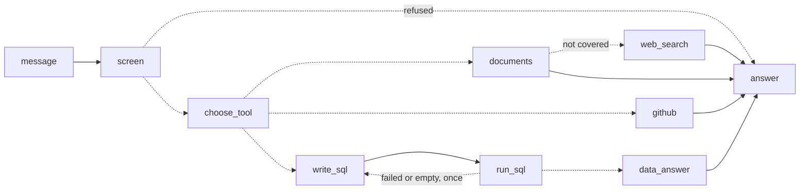

# Claude_Demo: a RAG, MCP and LangGraph learning demo

**Author:** [Jack Mei](https://www.linkedin.com/in/jcsmei209/), who
designed and directed the project, building it with Claude Code, an AI
coding assistant.

## Try the live demo

**[jcsmei209-claudedemo.streamlit.app](https://jcsmei209-claudedemo.streamlit.app/)**
· password: `demo209`

- If the app has been idle, click the button to wake it; that takes
  about a minute, and the first question after it is slow.
- Start with one of the example questions on the page, such as "Who
  built this demo, and what is his background?"
- It runs on free allowances, so it may ask you to try again later on
  a busy day.

A chat bot that answers from four kinds of source and always shows
where each answer came from:

- **Its own documents**, searched by meaning (RAG).
- **GitHub**, called live for the project's latest code changes.
- **NYC Open Data**, queried live with SQL for counts of taxi driver
  licenses.
- **The web**, searched through Tavily, but only when the documents
  do not cover a question. A web answer carries a warning that it
  is not from the project's official documents.

The same abilities are offered to AI assistants as tools through an
MCP server. The documents in `data/` describe the project itself, so
the bot can explain how it works, how it was built and what went wrong
along the way.

## The ideas it demonstrates

- **RAG (retrieval-augmented generation):** documents are split into
  chunks and stored in a Chroma vector database. A question retrieves
  the closest chunks, and a Groq-hosted model answers from them only.
  Each answer lists the passages it used and their distances.
- **Choosing the right tool:** text is searched by meaning, but a table
  is queried. For the taxi data the model writes read-only SQL, and the
  page shows the SQL and the rows it returned.
- **LangGraph:** the decision flow is a graph. One node chooses a tool,
  and the graph routes to that tool's nodes, including a retry loop for
  SQL that fails.
- **MCP (Model Context Protocol), in both directions:** the project
  runs an MCP server that exposes four tools to any MCP client, such
  as Claude Code, and it is itself an MCP client of Tavily's hosted
  MCP server, whose ready-made search tool it calls.



Dashed arrows are choices made while answering. The app draws this
diagram from the graph itself.

## How it fits together

| File | Role |
|---|---|
| `llm.py` | Sends a question to a Groq model and returns the reply. |
| `store.py` | Chunks documents, stores them in Chroma, searches them. |
| `rag.py` | Retrieves chunks, then asks the model to answer from them. |
| `tools.py` | Fetches live information from outside: the project's commits on GitHub, taxi driver license counts from NYC Open Data, and web results through Tavily's MCP server. |
| `chat.py` | A LangGraph graph that chooses the tool for each message, then answers with it. |
| `mcp_server.py` | Exposes the search, ask, commit and data query tools to MCP clients, with logging. |
| `app.py` | A password-protected Streamlit chat page that shows each answer with its source and the evidence behind it. |
| `data/` | The documents the bot searches, written as questions and answers. |
| `tests/` | Automated tests. |
| `.mcp.json` | Tells Claude Code how to start the MCP server. |

## Setup (Windows, PowerShell)

Requires Python 3.12 and a free API key from
[console.groq.com](https://console.groq.com).

```powershell
py -3.12 -m venv .venv
.\.venv\Scripts\Activate.ps1
python -m pip install -r requirements.txt
```

Then create a file named `.env` in the project folder:

```
GROQ_API_KEY=your_key_here
APP_PASSWORD=choose_a_password
```

`.env` is listed in `.gitignore`, so neither value is committed. Two
optional settings can be added to it: `GROQ_MODEL=<model id>` to use a
different Groq model, and `MAX_QUESTIONS=<number>` to change the limit
of 20 questions per visit.

GitHub and NYC Open Data are called without a key. Web search is
optional: add `TAVILY_API_KEY=your_key` (free from
[tavily.com](https://tavily.com)) to turn it on. Without it, a
question the documents do not cover is simply refused.

## Run

```powershell
python llm.py          # one question straight to the model
python rag.py          # index data/ and answer a question from it
streamlit run app.py   # the chat page
```

The first run downloads Chroma's embedding model (about 80 MB, once).
The database is written to `chroma_db/` and can be deleted at any
time; it is rebuilt from `data/`.

## The chat page

The page stays locked until the password is entered; with no
`APP_PASSWORD` set, nobody can get in. The live demo's password is
published at the top of this README on purpose: it keeps automated
visitors out, while the question, token and screening limits protect
the allowance.

- **Every answer names its source** and shows its evidence: the
  retrieved passages with distances, the commits fetched from GitHub,
  or the SQL that ran and its rows.
- **Follow-ups work.** The bot keeps the last two exchanges, and
  rewrites a follow-up such as "what tools does it have?" into a
  standalone question before choosing a tool.
- **It never answers from the model's memory.** If the documents do
  not cover a question, the bot says so and searches the web,
  listing the pages it used. Questions that name the project's
  creator are never searched on the web; they are refused.
- **Failures are explained**, with the stage that failed and the
  technical details.

## Limits

- **Groq's free tier** allows 8,000 tokens per minute and 200,000 per
  day for the default model. A chat message uses roughly 2,500 to
  4,000 tokens, so expect about 50 to 80 messages a day in total.
  Live testing draws on the same allowance as the deployed app.
- **Token use by answer type** (estimates): a documents answer takes
  two model calls and roughly 2,000 to 3,000 tokens; a web answer
  takes three calls and roughly 1,000 tokens more. Calling Tavily
  through MCP adds no tokens, because the code calls one named tool
  and the model never sees the server's tool descriptions.
- **Tavily's** free tier has a monthly allowance of searches; each
  web answer uses one. If it is used up, the bot falls back to its
  normal refusal.
- **Model fallback.** Groq counts limits per model, so when the
  default model is rate limited the same question goes to a second
  model, `openai/gpt-oss-120b`. Change it with
  `GROQ_FALLBACK_MODEL=<model id>` in `.env`, or set it to an empty
  value to turn the fallback off.
- **GitHub** limits calls made without a login, so commit results are
  reused for ten minutes.

## Prompt injection

The design assumes the model can be fooled, and limits what a
fooled model could do. Five layers:

- **Screening.** Each message is scored by Meta's Prompt Guard
  classifier, hosted by Groq, and refused if it looks like an
  attempt to override the instructions. Messages over 1,000
  characters are refused too.
- **Separate roles.** Instructions are sent in the system role; the
  passages, web pages, conversation and question are sent as data,
  with a rule never to follow instructions found inside them.
- **Tools fixed in code.** The model cannot change which database,
  repository or search tool is used, and SQL is limited to one
  read-only `SELECT`.
- **No secrets in prompts.** Keys and the password never reach the
  model.
- **No images in answers.** They are removed before display, which
  closes a known route for leaking a conversation.

No defence against prompt injection is complete. A classifier can
miss a clever attack, so the other layers do not depend on it. Set
`GROQ_GUARD_MODEL=` to an empty value to turn screening off.

## Privacy

Personal information is protected by rules in the code, each covered
by tests:

- **Counts only from NYC Open Data.** The dataset lists individual
  drivers by name; the data tool asks the city's API for counts
  grouped by the month a license expires, so no names or license
  numbers are downloaded, stored or shown.
- **No author details from GitHub.** Commit author names and email
  addresses are left out.
- **No web searches about people.** A message that names the
  project's creator, or contains an email address or a phone
  number, is never sent to a web search; it is refused.
- **No web searches about the project itself.** The web knows
  nothing about this project, so such a question is answered from
  the documents or refused, never from web pages about other
  projects.

A question is sent to Groq, and to Tavily when a web search runs.
A person named without contact details cannot be detected, so the
last rule is a safeguard, not a guarantee.

## Test

```powershell
python -m pytest -q
```

Use this exact form: `python -m pytest` lets the tests find the
project's modules, where plain `pytest` does not.

There are over 180 tests. They replace Groq, GitHub, NYC Open Data and
the embedding model with fakes, so they need no API key, cost nothing
and give the same result every time.

`tests/test_retrieval.py` is the exception: it uses the real embedding
model (downloaded once) to check that real questions still retrieve
the passage holding their answer. Run the tests after every change to
`data/`, because a new passage can push an older one out of the
results.

## Use the MCP server from Claude Code

Open this folder in Claude Code and approve the `rag-demo` server when
asked. Four tools become available:

| Tool | What it does | Uses Groq |
|---|---|---|
| `search_documents(query, k=3)` | Returns the `k` most relevant passages, with their source files and distances. | No |
| `ask_documents(question)` | Returns an answer drawn from the documents, plus its sources. | Yes |
| `recent_commits(limit=5)` | Returns the project's latest commits from GitHub. | No |
| `query_license_data(sql)` | Runs one read-only SQL query on live counts of NYC taxi driver licenses. | No |

Every call, rejected input and failure is recorded in
`logs/mcp_server.log`.

## Add your own documents

Put `.md` or `.txt` files in `data/`. The chat page re-indexes when a
document changes; for the MCP server, restart it. Chunks from changed
or removed text are replaced, not duplicated. Start each topic with a
`##` heading: a new chunk begins at every heading.

## How it was built, and what went wrong

Five of the documents are worth reading directly:

- [data/project_notes.md](data/project_notes.md): what the project is,
  how it was built, and the reason behind each decision.
- [data/break_fix.md](data/break_fix.md): every problem found along
  the way, each told as Situation, Task, Action, Result.
- [data/langgraph.md](data/langgraph.md): LangGraph in plain
  language, and how RAG, MCP and LangGraph fit together.
- [data/prompt_injection.md](data/prompt_injection.md): what
  prompt injection is and the five layers that defend against it.
- [data/tokens.md](data/tokens.md): token use by answer type, the
  rate limits and the model fallback.

## License

Released under the [MIT License](LICENSE). Copyright (c) 2026 Jack Mei.
You may use and adapt the code, provided the copyright notice stays
with it.
